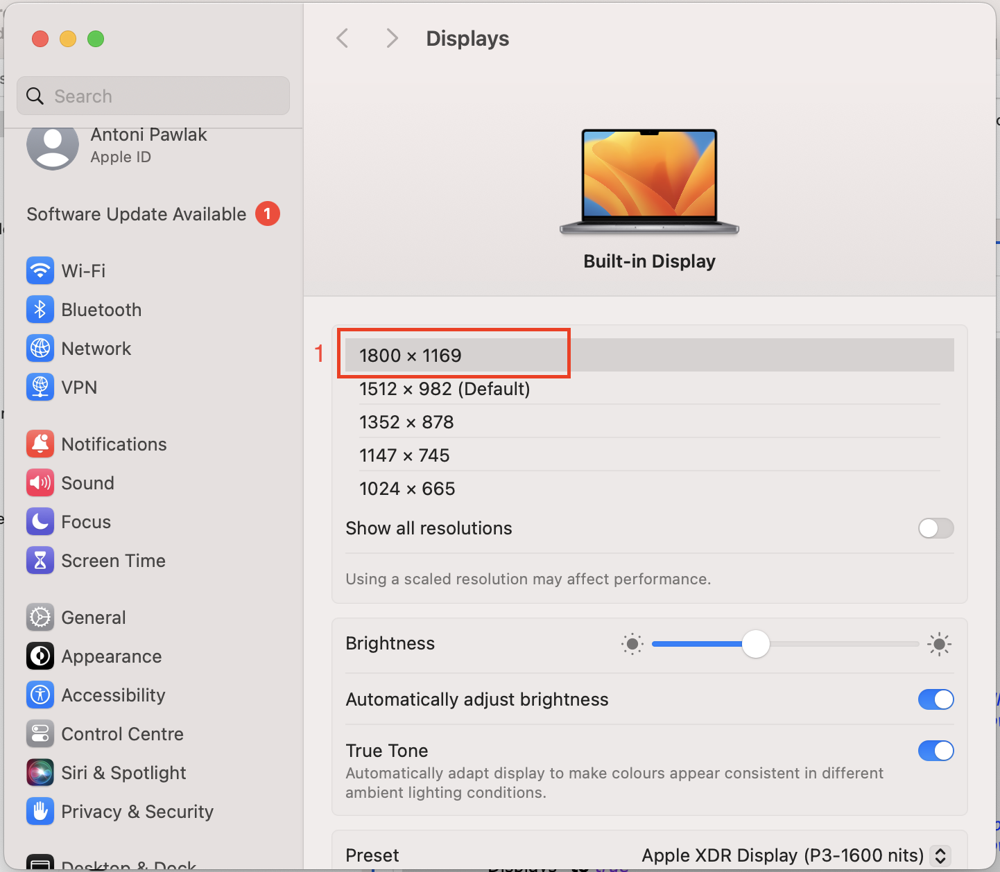
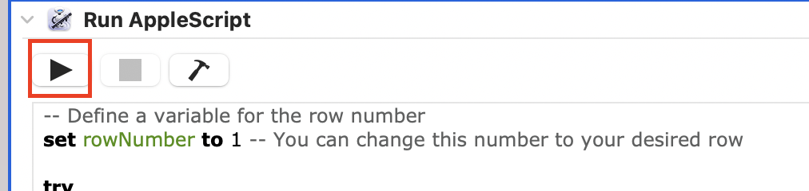
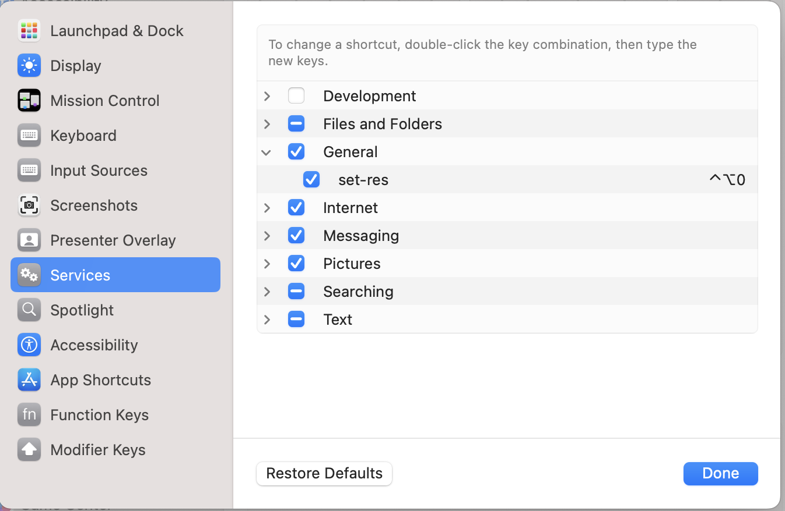

# TL;DR

Create Apple Script service via Automator and assign key binding to it.

Here is the issue on Apple Stack Exchange [link](https://apple.stackexchange.com/questions/263162/is-it-possible-to-change-display-resolution-with-a-keyboard-shortcut)

# Problem

I am using Docking Station to connect my Mac via USB-C to the external monitor. While the process in most cases works rather smoothly I am having a recurring issue with one thing: **disconnecting**

It is hard to precisely describe it or replicate, but if I close my Mac lid and disconnect it from the station, next time I log in there is a problem with resolution - making the laptop unusable until I hold the power button to shut it down and reboot.

# Solution

I needed a way to change the resolution without the access to the GUI. The easiest solution that came to my mind was **keyboard shortcut**. I googled and found an [answer](https://apple.stackexchange.com/questions/263162/is-it-possible-to-change-display-resolution-with-a-keyboard-shortcut)

1. Automator -> File -> New -> Quick Action -> **Run Apple Script**
2. Displays -> Advanced -> Show resolutions as list
   Choose which resolution will your script set (for me it will be the 1st)
   
4. Past the source code to the Automator & save

```
-- Define a variable for the row number
set rowNumber to 1 -- You can change this number to your desired row

try
	if application "System Settings" is running then ¬
		do shell script "killall 'System Settings'"
end try

repeat until application "System Settings" is not running
	delay 0.1
end repeat

tell application "System Settings"
	reveal anchor "resolutionSection" of ¬
		pane id "com.apple.Displays-Settings.extension"
end tell

tell application "System Events" to tell process "System Settings"
	repeat until exists of table 1 of scroll area 1 of group 1 of scroll area 2 ¬
		of group 1 of group 2 of splitter group 1 of group 1 of window "Displays"
		delay 0.1
	end repeat

	-- Use the variable for the row number
	set selected of row rowNumber of table 1 of scroll area 1 of group 1 of scroll area 2 ¬
		of group 1 of group 2 of splitter group 1 of group 1 of window ¬
		"Displays" to true
end tell

tell application "System Settings" to quit
```

4. Test the behavior
   
5. Set keyboard shortcut: Keyboard -> Keyboard Shortcuts -> Services -> General -> Your Quick Action
   
6. I am using `Control + Option + 0`
7. If you hit shortcut for the first time the pop-up will appear, click OK to allow for your action to run

### Thanks for reading
