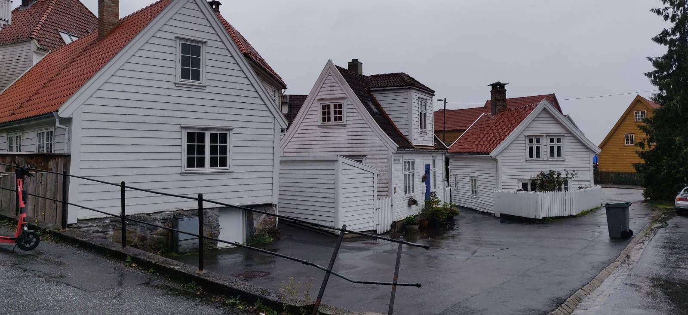

## The fjord cruise dream

I wanted to have unforgettable summer trip with my girlfriend. During last year I was saving money for that, but the catch is, I did not know the destination. Until one June's evening when I got struck by this idea: I really love nature and want to see something unique. Fjords were the first to pop out of my mind. And that was it, immediately I knew where I wanted to go. At first it seemed really expensive and very distant financially, until I found this amazing [blog post](https://wypiszwymalujpodroz.pl/praktyczny-poradnik/europa/norwegia/rejs-po-fiordach/). I can't stress this enough how much it helped me to transition the idea from dream to reality. Without it I am not sure whether I would be writing those words today.

> Searching online for your travel plan is a no-brainer. Probably there exists a blog where someone describes in detail how to make your dream come true.

## ✈️ Flight

I have the flight using [skyscanner](https://www.skyscanner.pl/), it has pretty decent feature where you can find cheapest flight in given month or even a year. I bought tickets for Wizz Air, this is cheap airline, will do the job in most cases. But if you have more money I would probably recommend [Norwegian](https://www.norwegian.com/), because both my flights were delayed by cumulative 3 hours.

## 🛎️ Accommodation

I have found cozy room in the city center using [airbnb](https://www.airbnb.pl/rooms/52551244). It was enough for our needs. The host was nice, room was clean and had an amazing location.

> Flight and accommodation is the very basis for cheap travel. I recommend checking them in parallel and booking both if you found both. Because if you book flight without looking at airbnb you can be left with overpriced apartment.

## Bergen

Why Bergen? Because it is close to the fjords. What an understatement it is! During those few days, in my mind Bergen went from being the base for the fjord cruise to the . There is certainly something to this city. I loved the vibe of, especially during the rainy day. I felt the real Bergen. The cloudy, rainy, grayish Bergen. Now I know why they paint their houses so colorfully. Also their minimalism and connection to the nature is something I will remember for years. Sandviken and Nordnes are two neighborhoods that I recommend visiting. Just go there and get lost in those small streets, going whatever direction your heart tells you.

Why to have boring houses when you can have them in color?

---

Why to have streets level when they can be waves?

---

Why to have big houses when you can have them small?

---

<!--  -->
Why to choose between nature and architecture when you can have them both?

---

I love panoramas of the city, and Bergen certainly has a few. Among many I can recommend Floyen and Stohlzkleiven, which after relatively short hike offer spectacular view on the city.

---

<!--  -->

Local food is the ultimate way of feeling the city. After trying the fishsoup I finally understood Bergen. It was one of the best meals I had in my life. I love the taste of fish and dairy, so the soup which is a perfect connection which my taste buds will not forget for quite some time. Sitting in the restaurant with the view on the street, eating local soup and reading a newspaper (even though I do not know norwegian) was a metaphysical experience. Opened doors in my mind that could not be opened at home on my sofa.

> City with great historic soul, streets to wander around, panoramas around and delicious local food is a recipe for unforgettable experience.

## Fjord cruise

First step is take the train from **Bergen to Myrdal**. This is a small, very small village in the mountains. When entering the train station there is an alpine vibe in the air. You see mountains, hear nothing and the air is so clean. Every breath tastes different. And this is just the beginning of the trip.

---

Next we took Flamsbana from **Myrdal to Flam**. Flamsbana is a unique train that takes you through the mountains to the fjord cruise port. During approximately one hour trip you see breathtaking views out your windows, valleys, mountains, waterfalls. There is an audio guide inside which was surprisingly interesting. This was the first train that I took that had 5 minute planned break to get out the train and take the picture.

---

Flam is a small town, with some unique geographic traits. It lays in the beginnig of **Aurlandsfjord** and has a port from which cruise ships can start. The journey will last about 2 hours and take us through two beautiful Sognefjord branches: Aurlandsfjord and Nærøyfjord. We cannot wait for the trip to start, you should be looking where Sabina is pointing ^^

---

View so amazing that you probably did not notice that the panoramic photo is broken 🙃

---

That is how small you can feel. Among fjords one can feel familiarity to other human being not found in many other places. We really are similar you compared to the rest of nature.

---

This waterfall in the background really took my words away, in that moment I could only sigh. Ooooh what a view... Perfect ending of the trip. The stamp. Memory.

---

## Useful links

todo
