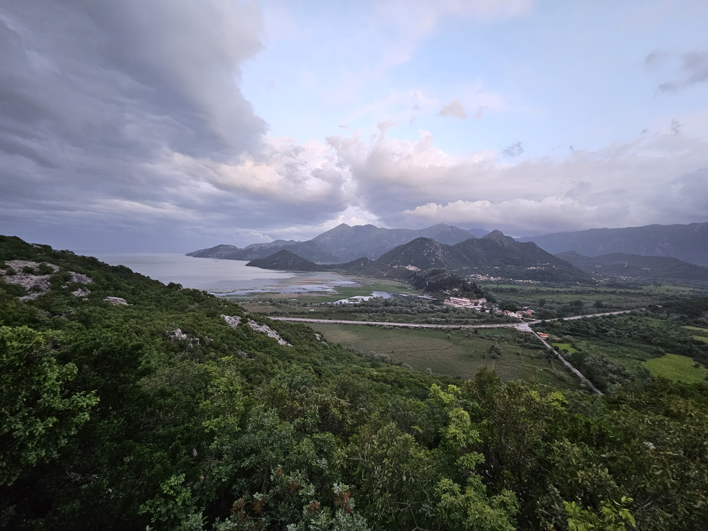
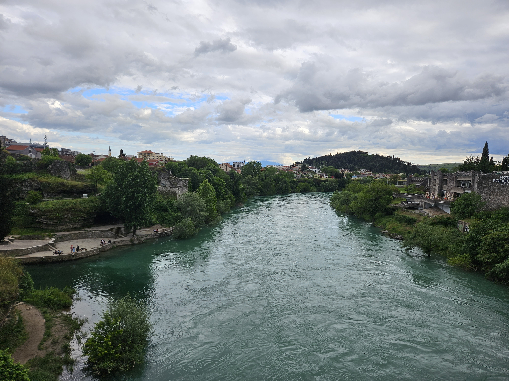
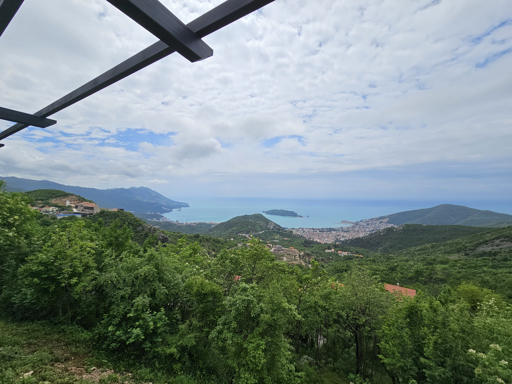
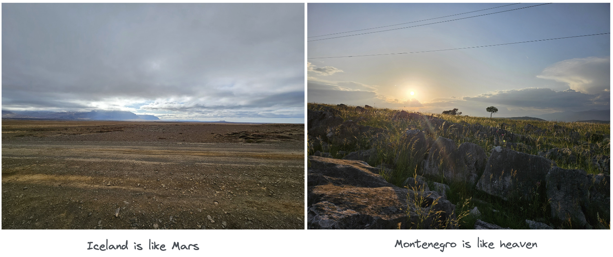
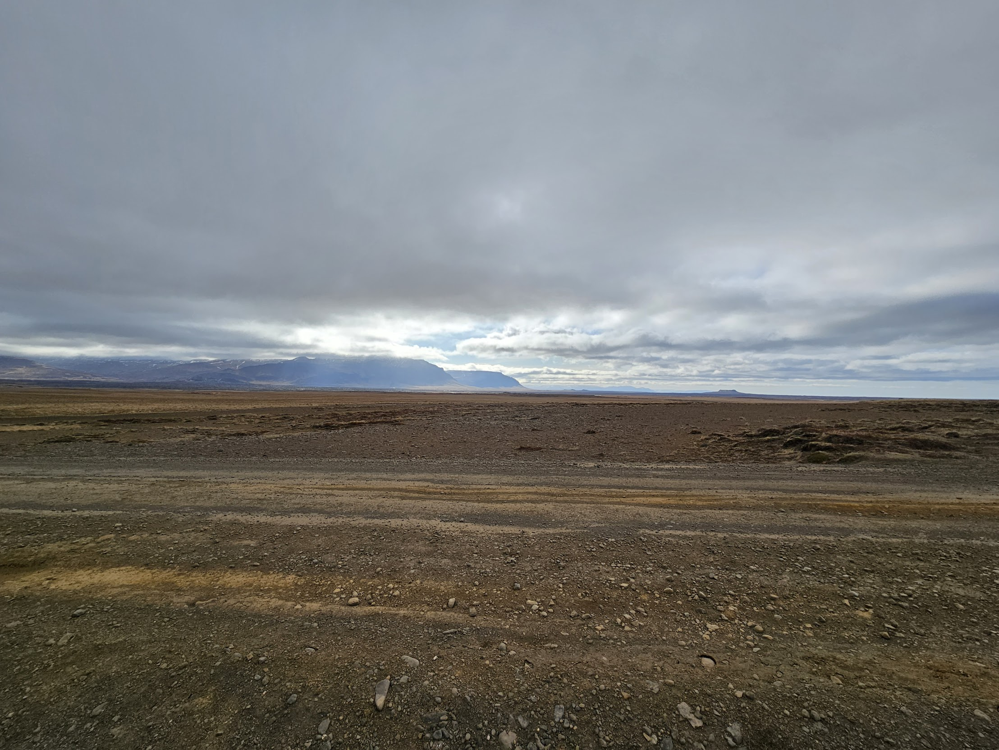
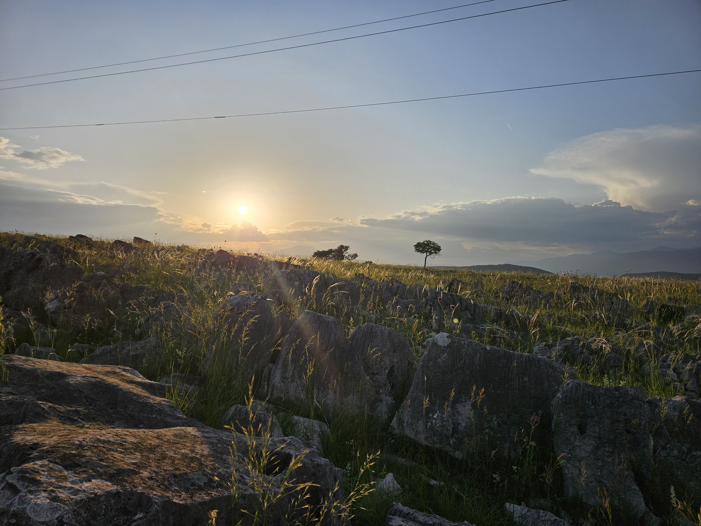
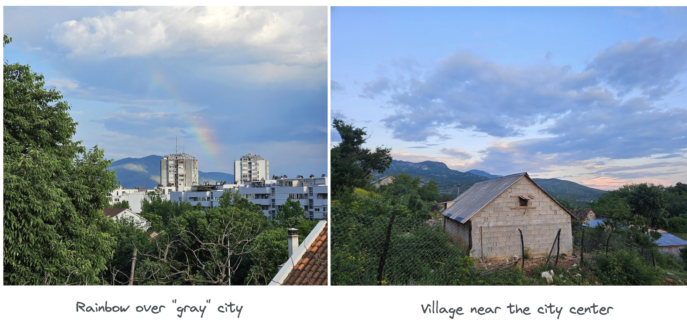
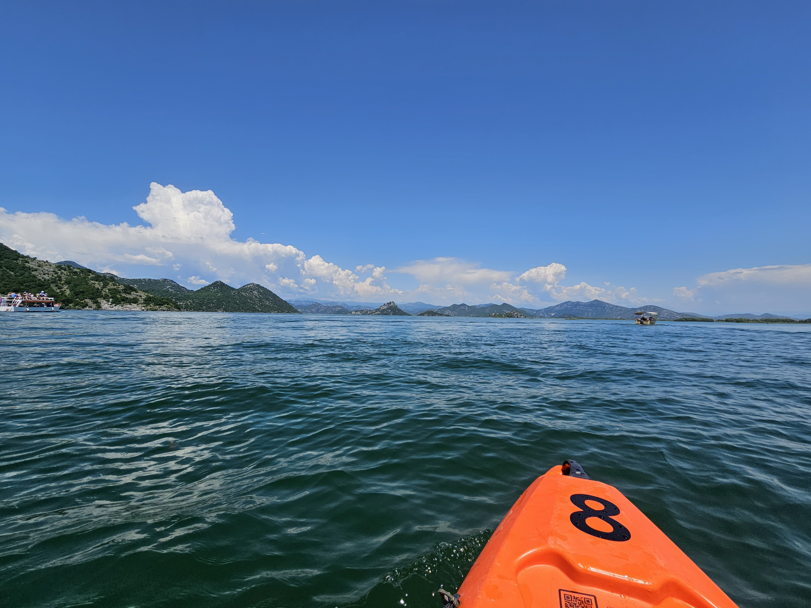

# Serendipity

~ **_the occurrence and development of events by chance in a happy or beneficial way_**

Montenegro and my whole experience can be very well described by this word. To be honest, before the journey, I have only known the name of the city that I am going to and that "Montenegro is beautiful". The day before the flight I found out that a passport would be required to enter this country. Simply speaking: I was not prepared for the trip.

But what's best about Montenegro is that you don't have to be prepared, things will just happen, people will help, beautiful places will pop out of nowhere, and tasty food will enter your plate. The experience will not be "A -> B", but instead "Absolutely Best", but you have to be prepared that everything there is creating a sentence, not necessarily obeys the requirements.

## Interesting facts & findings

I will start with the list of things that I have noticed during the trip and later will follow up with some more in-depth analysis of the experience.

- there is no roaming
- passport is needed to enter
- Montenegro gained independence in 2006
- they use Euro but do not participate in European Central Bank
- the public transport infrastructure is very bad, you can only take a taxi from the airport
- no Uber
- there are a lot of tall people
- smoking in restaurants is allowed
- parking is "allowed everywhere"

Every day something amazed me, how chaotic the rules in Montenegro feel. I like rules and order, but to be honest from time to time it is very refreshing to change the environment. I wonder what is best: chaos or the rules, probably the answer lies somewhere in the middle...

## Pictures

After that many pieces of information let's chill and see some beautiful pictures before we start our philosophical endeavor.

> Lake Skadar and its surroundings
> 

> Male Brno hill
> 

> River in Podgorica
> 

> Coast of the Mediterranean Sea
> 

## Two different worlds

During a relatively short period of time, I had the pleasure to visit two beautiful places: Iceland and Montenegro. It would be hard, or even foolish, not to try to make a comparison...

> Iceland sometimes feels like Mars, Montenegro sometimes feels like heaven

### Mars

Iceland is simply said amazing. Breath-taking, out-of-this-world, astonishing. You are constantly being impressed by what you see, impressed and amazed at the same time. It felt like visiting another planet, the scapes were so different compared to what I was used to seeing. When I envisioned visiting other planets it certainly looked like this...

### Heaven

To begin with, it does not mean that Iceland is like hell. I want to convey a bit more philosophical message about the way we perceive the world. I was born and grown in Poland and wholeheartedly believe that it is the most beautiful country in the world. Visiting Montenegro felt sometimes as if looking through Samsung camera lenses, the colors were a bit brighter and more saturated than in Poland. Also, life there is a bit slower, it is fairly easy to find a place near the city center where human is nowhere to be seen. During one of my walks on the hill overlooking the city, I felt that this is exactly how I envisioned heaven when I was younger...

> I cannot say that I have enjoyed one place more than the other, they were just different and beautiful in their own sense.

---

## Time machine

> Montenegro is like Poland 20 years ago

This is basically one of the first thoughts I had during the walk through the city center. It just feels less "developed" and makes you think what does even this word mean? Does it mean "better", or maybe "faster"? One thing that I can say for sure is that it feels more "chaotic" than Poland and a bit more "poor". But to be honest both countries are fulfilling the basic needs of the citizens. Montenegro feels less flashy, there are not that many expensive buildings or restaurants. The infrastructure is not that great. It all feels a bit like going back in time to my childhood days. But I do not perceive it as a bad thing (tourist, not citizen perspective). On the other hand people there seems a bit slower and grounded in reality, noticing the other human being and spending time together. Maybe when the economic investments are not going great you are starting to invest in relationships?

I started this blog post with the words that "I was not prepared for the trip". What struck me is that no one there requires you to be prepared, you have to go and ask because the information is not laid out in our Western-like perfectionist style. Instead, you have to communicate, the more you talk the more you know. You can ask stupid questions and no one will look at you like an idiot, but helpfully answer. The Airbnb host, the lady on the news stand, the waiter, the shop assistant, even the passer-by, they are all just helpful and have time for you, notice you, and smile. Compared to that the random interactions in Poland really feel without a soul sometimes.

> Montenegro has some vibes that Poland lost along the way of socio-economic development

---

## Lake Skadar is 🔥

When being in Montenegro this is an absolute must-see, and while you are here there are two things that you really have to do:

- **_kayak/boat trip_**, I recommend renting and going at your own pace, don't forget to swim in the lake
- **_carp_**, seriously eat this fish there, it's delicious, I recommend Restaurant Pelikan

# Extras:

- Rain feels different

- Renting a car opens up a country

- EDCON

- Makłowicz mania
